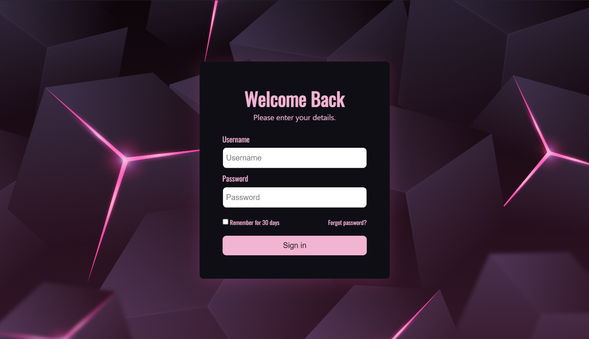

# Login UI Project

**Requirements:**
- The login box must be centered in the screen and stay in the center of the screen even as you resize the web-browser window.
- You must use flexbox properties to achieve this, not margin, padding, or position.
- The login box should have a minimum size, and the input fields or text in the box should not leak out of the box.
- The login box should have box-shadow and rounded edges.
- The login box should have a username and password input field, with placeholder text like in the photo.
- The text entered into the password field must be hidden (with asterisks or circles)
- The login box should have a button.  

**Extra Credit:**
- Pictures as backgrounds or part of the Login UI.
- Other Designs for Logins.
- Additional design features to the login box.
- Experiment with colors if you would like, feel free to use the color palette generator.   

**Project Screenshot:**

